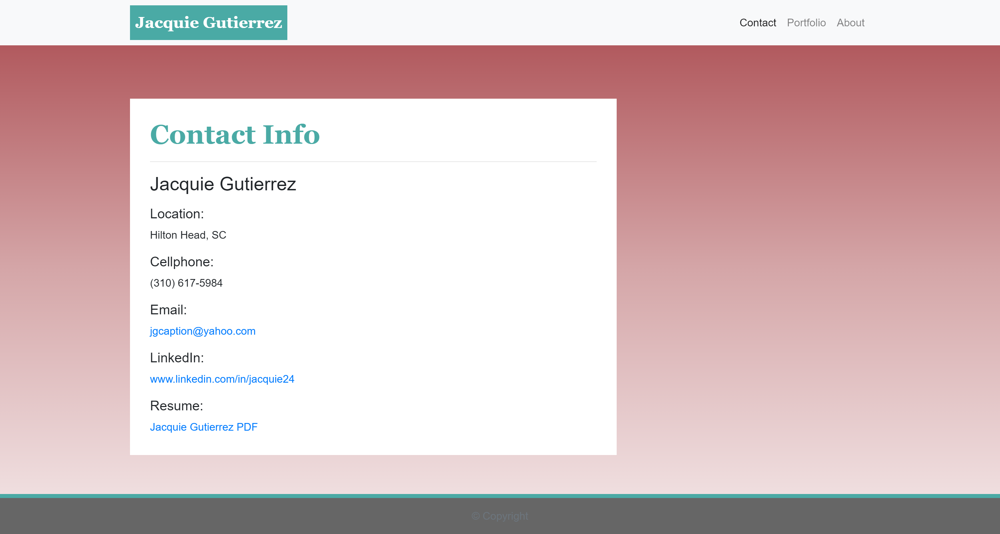
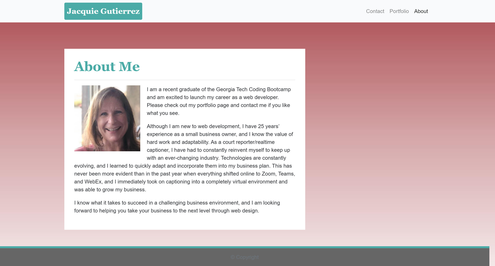

# updated-portfolio

## Description
The goal of this project was to create three linking web pages utilizing the dynamic elements from Bootstrap and making use of their containers.  As the size of the viewing screen grows and shrinks, the elements of the page should change along with it.  In addition, I made sure that the semantic HTML tags were put into the code, as Bootstrap's code mostly bears the generic 
 tags.  

The finished pages feature a navigation bar at the top containing three navigation links.  Each page features different content, but they bear similar color schemes and layouts, which gives the viewer a feeling of continuity.

Lastly, I ran the page through the html validation service at [W3C](https://validator.w3.org/) and made the suggested changes in my code.

To see the final result, you can view the webpages live at [updated-portfolio](https://jacquie24.github.io/updated-portfolio/).

## Usage
When the user clicks on the link, the page defaults to the About Me screen as the home page.  At the top are three navigation links, titled "About," "Portfolio," and "Contact."  
"Portfolio" will take the user to the Portfolio screen to view my projects. 
"Contact" will take the user to the Contact screen, where there is a fillable form to provide contact information. 
"About" brings the user back to the About Me screen.  
In addition, by clicking on my name "Jacquie Gutierrez" in the upper left hand corner, it will bring the user to the About Me (default home page).

## Installation
To view this webpage and any others I've designed, check out my GitHub repository at [Jacquie24](https://github.com/Jacquie24?tab=repositories).  

## Credits
Much of the code for this project came from [Bootstrap](https://getbootstrap.com/), and I gained my understanding of the code by reading their documentation, which is very thorough.

## License
This page is using the [MIT](assets/license.txt) license.

